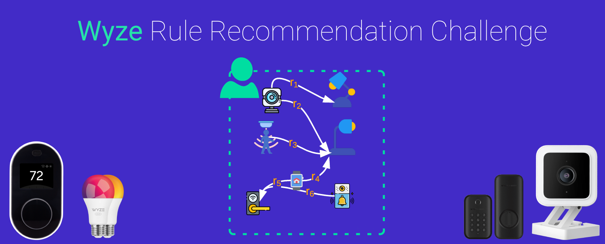
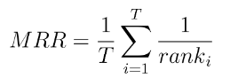

# wyze-rule-recommendation

This repository showcases the second-place solution for the HuggingFace challenge hosted by Wyze Labs. 
For detailed information about the challenge, please refer to the original
[link](https://huggingface.co/spaces/competitions/wyze-rule-recommendation).

[](https://huggingface.co/spaces/competitions/wyze-rule-recommendation)

The challenge focuses on creating a recommendation system for smart home automation, specifically targeting 
the suggestion of rules to users. Each user possesses a diverse collection of devices spanning 16 different types, 
including Cameras, Motion Sensors, Thermostats, and more. Users can establish rules, each identified by a trigger 
device, a trigger state, an action device, and a corresponding action. 
The task at hand involves proposing new rules for users.

The dataset provided by Wyze Labs consists of:

- A training set containing actual rules defined by users. 
- Two test set splits (public and private), each containing actual 
rules with a leave-one-out design to assess the implemented system.

Each split includes a list of rules and a list of devices, along with their associations with users.

The devised solution formulates the problem as a link prediction task
and leverages a Graph Neural Network (GNN) implemented in 
PyTorch-Geometric. The model is trained using positive 
and negative sampling from the training set provided by Wyze Labs.
Significantly,  this solution builds upon the foundational approach 
outlined in [FedRule](https://arxiv.org/abs/2211.06812). However, it enhances the
overall performance by incorporating batched training and making 
distinct architectural choices. Further
insights into these improvements can be found in the [Approach](#approach) section.


The evaluation metrics for the competition is the mean reciprocal rank (MRR),
defined as




## How to install
Install the dependencies in a virtual environment
```
pip install -r requirements.tx
```


## Training
You can train a new model by.......

## Test


## Approach

The problem has been framed as a link prediction task, wherein a graph is constructed for each user. The graph structure is defined as follows:

Each device serves as a node, with each node characterized by a node feature representing the device model (e.g., Camera, Cloud) using one-hot encoding.
Every rule is depicted as a directed edge connecting the trigger device to the action device. The edges may vary in type based on the trigger state and action state, with the dataset containing 45 trigger states and 47 actions.
For each graph, the model incorporates the following components:

Embedding layers are utilized for both trigger state and action for each edge.
Node types are one-hot encoded.
Edge features are aggregated per node and concatenated to node features.
Two SageConv layers are applied to the aggregated features.
This component acts as a node embedding, providing an embedding vector for each node. At this stage, a set of links is considered for prediction. The prediction process involves:

Concatenating the embedding vector for nodes in the edge.
Applying a classification head with a sigmoid activation function to predict the edge probability.


